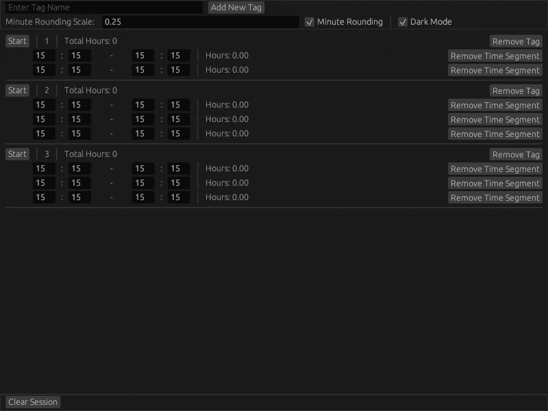

# Daily Time Keeper
The purpose of this tool is to assist with keeping track of the number of hours per task (or called tags in this program).

In essence, Daily Time Keeper behaves such as a multi-line stopwatch.
Each tag has a start or stop button which will record time stamps into a time segment.
The tool calculates the amount of hours passed from the starting time stamp to the ending time stamp for each time 
segment. Then all the time segment hours is totaled per tag.

## Release 0.1
This release is the minimum viable product. It's rough around the edges but has enough functionality to aid with 
time keeping.

Things to note:

* Minute rounding scale is a float that serves as the goal for each time stamp to round towards (if rounding is enabled).
The default value is 0.25 which translates to 15 minutes.

* Daily Time Keeper will automagically create a save file (daily-time-keeper.toml) so tag names, minute rounding scale 
value, and if minute rounding is enabled will persist through different instances of the tool. 
Any changes (such as removing or adding tags) will cause the tool to create (or overwrite) a toml file in the working
directory. 

* Time segments will **not** be saved between instances. Closing the tool will wipe all time stamps.
The `Clear Session` button will wipe all time stamps as well without a prompt.

* Only Windows is supported at the moment

## Libraries Used
* [eframe](https://crates.io/crates/eframe) - The egui framework. GUI library for Rust.
* [time](https://crates.io/crates/time) - Date and time library for Rust.
* [serde](https://crates.io/crates/serde) - Generic serialization and deserialization framework.
* [toml](https://crates.io/crates/toml) - TOML encoder and decoder.

## License
Licensed under either of

* Apache License, Version 2.0, ([LICENSE-APACHE](LICENSE-APACHE) or http://www.apache.org/licenses/LICENSE-2.0)
* MIT license ([LICENSE-MIT](LICENSE-MIT) or http://opensource.org/licenses/MIT)

at your option.
